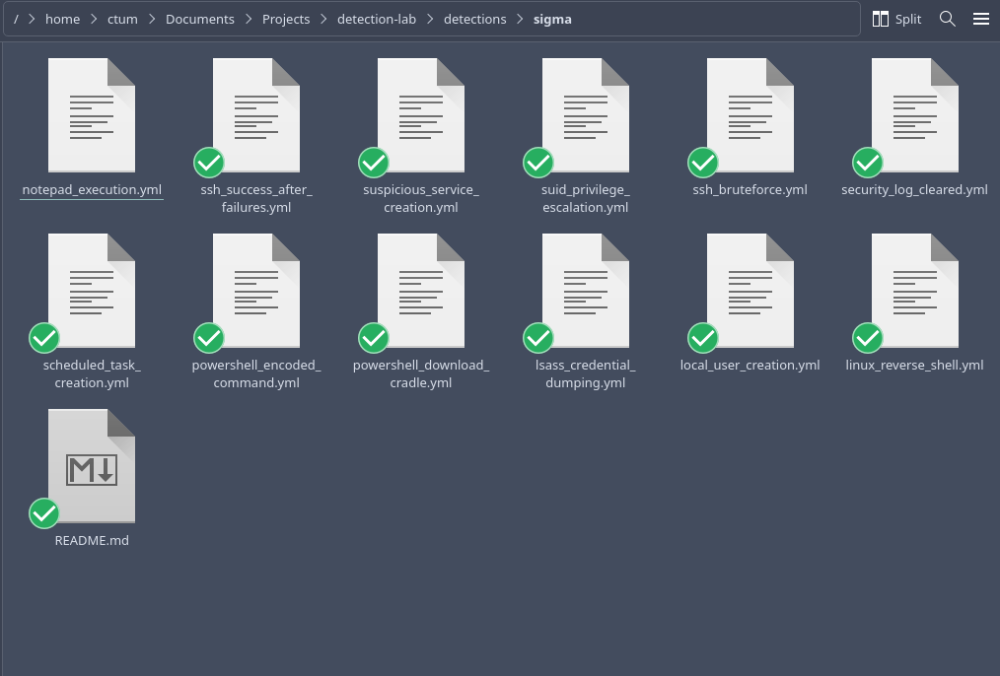
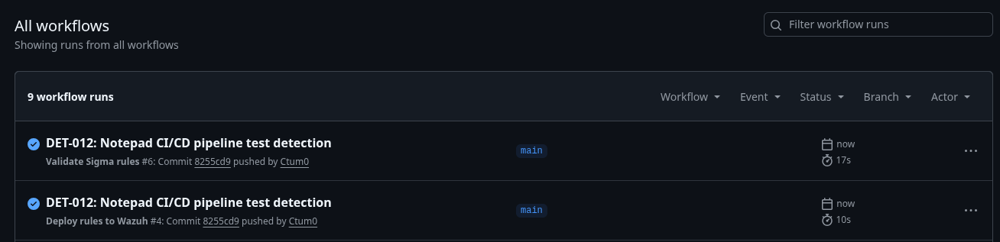
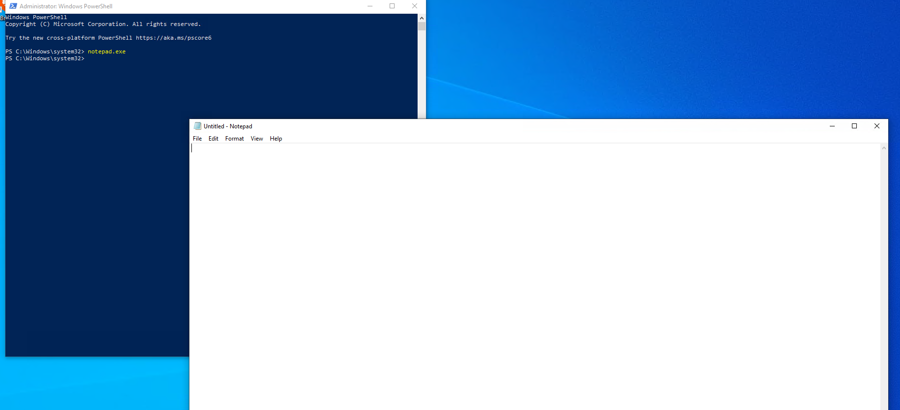
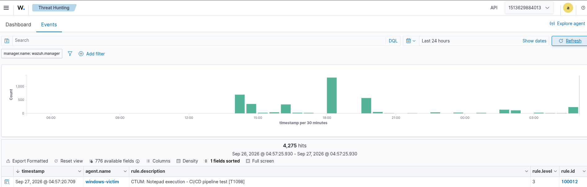

# Pipeline demo: DET-012 Notepad end-to-end

Proof that the full Sigma → CI → Wazuh loop works, using a trivially
triggerable canary rule (`notepad_execution.yml` → Wazuh 100012).
Commit `8255cd9` ("DET-012: Notepad CI/CD pipeline test detection").

## 1. Sigma rule committed

`detections/sigma/notepad_execution.yml` lands in the repo — the source of
truth. (Fixed after the fact: single-backslash `Image|endswith` per repo
convention, plus the missing `attack.t1098` technique tag; `sigma check`
stays clean.)

## 2. CI validates green

`Validate Sigma rules #6` passes on the push (shares this screenshot with
step 3 — one Actions page showed both green runs).

## 3. Deploy pushes to Wazuh

`Deploy rules to Wazuh #4` greens. It PUTs `custom_rules.xml` to the manager
API and the verify step confirms HTTP 200 — look for
`Deployed OK (HTTP 200)` in the run logs (`.github/workflows/deploy-wazuh.yml`).

## 4. Attack: run notepad on the victim

`notepad.exe` launched from Admin PowerShell on windows-victim, Sysmon EID 1
ships via the Wazuh agent.

## 5. Alert: rule 100012 fires

Threat Hunting shows `CTUM: Notepad execution - CI/CD pipeline test
[T1098]`, rule.id **100012**, on windows-victim. Loop closed: repo → CI →
manager → victim → alert.
